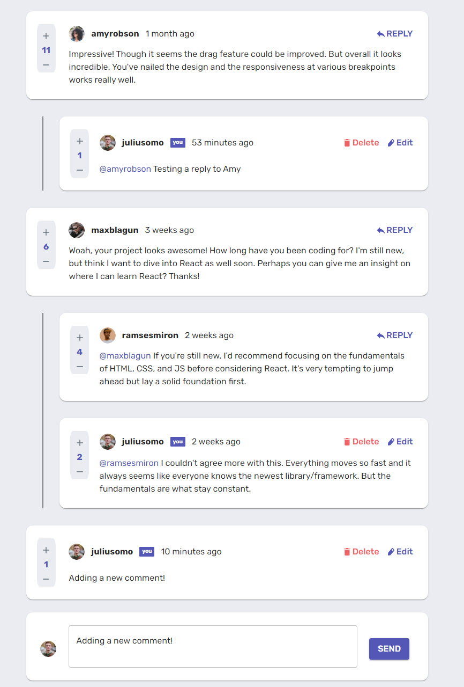

# Interactive Comments

This is a solution to the [Interactive comments section challenge on Frontend Mentor](https://www.frontendmentor.io/challenges/interactive-comments-section-iG1RugEG9).

## Table of contents

- [Overview](#overview)

  - [The challenge](#the-challenge)

  - [Screenshot](#screenshot)

  - [Links](#links)

- [My process](#my-process)

  - [Built with](#built-with)

  - [What I learned](#what-i-learned)

  - [Continued development](#continued-development)

  - [Useful resources](#useful-resources)

- [Author](#author)

## Overview

### The challenge

Status of project based on initial criteria given for the challenge -

- [x] View the optimal layout for the app depending on their device's screen size

- [x] See hover states for all interactive elements on the page

- [x] Create, Read, Update, and Delete comments and replies

- [x] Upvote and downvote comments

- [x] **Bonus**: If you're building a purely front-end project, use `localStorage` to save the current state in the browser that persists when the browser is refreshed.

- [x] **Bonus**: Instead of using the `createdAt` strings from the `data.json` file, try using timestamps and dynamically track the time since the comment or reply was posted.

### Screenshot



### Links

- Solution URL: [https://github.com/jpal91/comments-nextjs/](https://github.com/jpal91/comments-nextjs/tree/comment-app)

- Live Site URL: [https://comments-nextjs.vercel.app/](https://comments-nextjs.vercel.app/)

## My process

### Built with

- [Next.js](https://nextjs.org/) - React framework

- [Material UI](https://mui.com/material-ui/) - For CSS Components

- [MongoDB](https://www.mongodb.com/) - Database

### What I learned

This was the first full Next.js app I completed on my own. Prior to this I've only dealt strictly with React. Unfortunately, I did not get to take advantage of the static optimizations that Next provides in this app, but I'm very pleased with how it turned out.

#### _Context_

One big learning opportunity I had was to work with React useContext() for an actual app. In prior projects, I've mainly relied on Redux for state management. I want to try to incorporate this in future Next projects, but Context was great to learn regardless.

```js
const ReplyContext = createContext({
  openReplies: [],

  addReply: (comID) => {},

  removeReply: (comID) => {}
});
```

I used this piece of context to manage when a reply was "open" or "closed". Basically I was able to monitor when a reply button was clicked on a comment and open on click and close on submit.

#### _mutate/useSWR( )_

This amazing Next.js feature saved me a ton of time trying to figure out how to manually re-render after comments had been changed, submitted, or edited.

Calling mutate after any api call automatically tells all other instances with the same api route to re-fetch it's data. This helped when I had api calls within deeply nested components and it would be more difficult to coordinate the re-fetching of data across them otherwise.

```js
const fetcher = (url) => axios.get(url).then((res) => res.data);
const { data, error } = useSWR("/api/all-coms", fetcher);
```

This call sits at the top of the app on the index.js page. As soon as the page loads, a call is made to the api / database to pull all comment data. Then in individual components -

```js
mutate("/api/all-coms");
```

This "remotely" calls the same useSWR hook to refresh data. Mutate was used after adding, deleting, or editing a comment to easily re-render all comments. I will absolutely be using this in another Next.js project that's client-rendering heavy.

### Continued development

Ultimately there's one big thing I'd like to add to this app - user authentication. That would require quite a bit more coding, so for now I am going to plan to implement this same code in another future app that does have the ability to create users (like a blog perhaps).

These are the areas I would like to develop more:

- Redux/Thunk w/ Next.js - I would very much like to add into another Next.js project for state management - I will need to work with new packages that can integrate with Next.js
- Context/useContext - It would be great to get more experience with context as it was fairly straightforward - Was great as a substitute for Redux in this app, but still wasn't enough - I want to find more use cases for context outside of a replacement for Redux
- MUI ThemeProvider - I got a lot more experience with setting up initial style values and want to continue to expand - I was only able to set up a handful of components with initial style values, I want to work up to getting all used CSS components an initial value

### Useful resources

- [Material UI Library](https://mui.com/material-ui/) - Helps me out on every project, huge library of free CSS components to use.
- [SWR](https://swr.vercel.app/) - Seriously awesome for any client side rendering on a Next.js app
- [timediff](https://www.npmjs.com/package/timediff) - Cool npm package I found to solve the "x time ago" issue found on this app easily. It of course could have been accomplished programmatically, but this was just way easier.
- [MongoDB Manual](https://www.mongodb.com/docs/manual/) - Full docs for MongoDB

## Author

- Website - Coming soon...

- Frontend Mentor - [@jpal91](https://www.frontendmentor.io/profile/jpal91)

- GitHub- [https://github.com/jpal91/](https://github.com/jpal91/)
